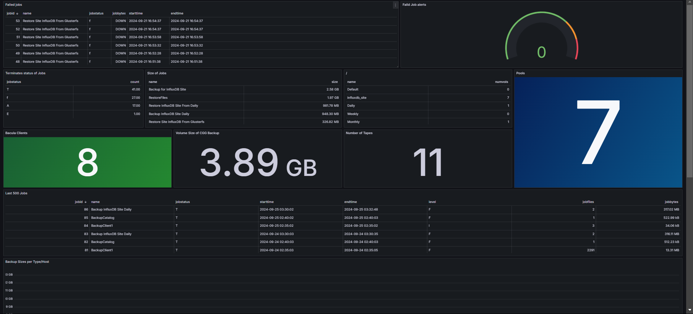

# Bacula-Grafana

An integration tool that connects **Bacula**, the enterprise-level backup solution, with **Grafana**, the open-source analytics & monitoring solution. Visualize your Bacula backup metrics in real-time dashboards for better insights and monitoring.

## Features

- **Real-Time Monitoring**: Get instant updates on backup jobs, statuses, and performance metrics.
- **Custom Dashboards**: Pre-built Grafana dashboards tailored for Bacula metrics.
- **Alerting System**: Set up alerts for backup failures, storage thresholds, and more.
- **Easy Configuration**: Simple setup with minimal configuration required.
- **Extensible**: Modular design allows for easy extension and customization.

## Prerequisites

- **Bacula**: Version 9.0 or higher.
- **Grafana**: Version 7.0 or higher.
- **Database**: MySQL, PostgreSQL, or SQLite (compatible with Bacula's Catalog database).
- **Go**: If building from source, Go 1.15 or higher.

